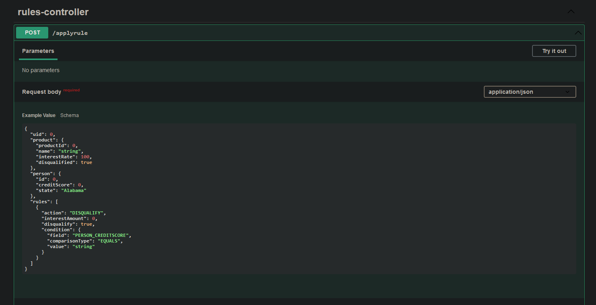
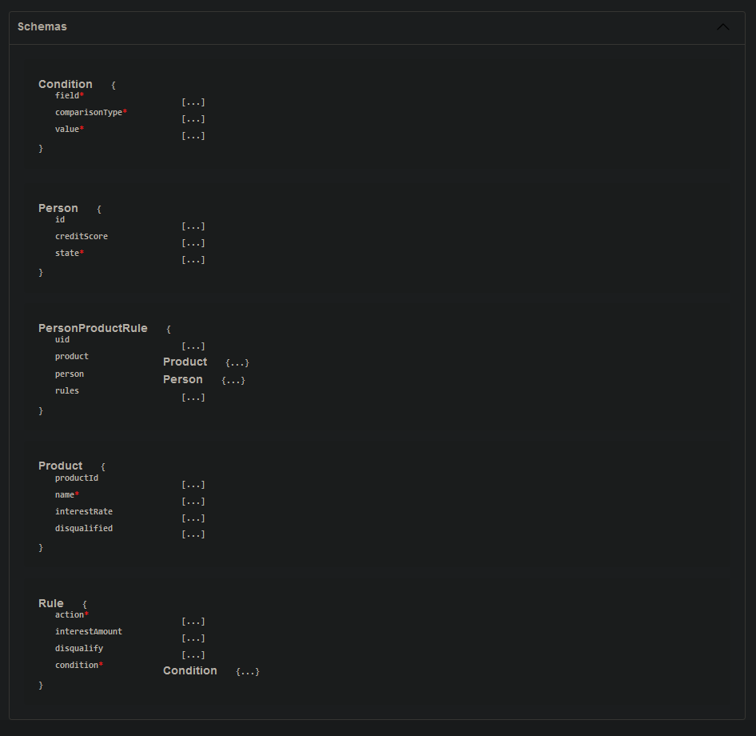
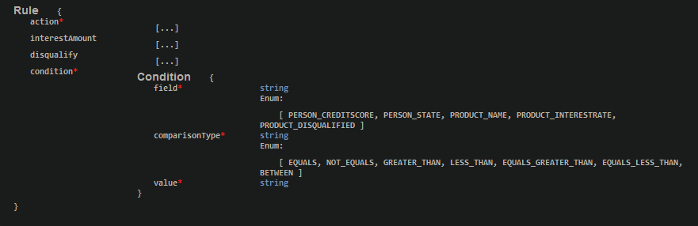

# Visio Rules Engine
Rules engine for calculating loan product pricing from a set of rules.

## Requirements
For running the application you need:
- [JDK 17](https://www.oracle.com/java/technologies/downloads/#java17)
- [Maven 3.5+](https://maven.apache.org/)

## Running the application
- Clone the [project](https://github.com/stevex249/visio.rulesengine)
- Open up the project locally by navigating to `\RulesEngine`
- Run `mvn clean package` to install dependencies and package the project
- Run `mvn spring-boot:run` to start up the project
    - Swagger is installed and can be accessed by navigating to [http://localhost:8080/swagger-ui/index.html#/](http://localhost:8080/swagger-ui/index.html#/) (port 8080 is default)
- Tests are included in the `src\test` directory and can be run using `mvn test`

## Using the application
- You can access the main rule endpoint at `http://localhost:8080/applyrule` using any API platform (The easiest way would be to use the included Swagger UI)



- Send in your person, product, and set of rules in the following json format:

```
{
  "product": {
    "name": "Test",
    "interestRate": 5.0,
    "disqualified": false
  },
  "person": {
    "creditScore": 650,
    "state": "texas"
  },
  "rules": [
    {
      "action": "INTEREST",
      "interestAmount": -2.0,
      "disqualify": null,
      "condition": {
        "field": "person_creditscore",
        "comparisonType": "BETWEEN",
        "value": "600,720"
      }
    },
{
      "action": "DISQUALIFY",
      "interestAmount": null,
      "disqualify": true,
      "condition": {
        "field": "person_state",
        "comparisonType": "EQUALS",
        "value": "texas"
      }
    }
  ]
}
```

- The example above should return the following 200 response:

```
{
  "productId": null,
  "name": "Test",
  "interestRate": 3,
  "disqualified": true
}
```

- The schema is also included on the Swagger UI and can help you determine inputs:



For example the field and comparisonType properties can take any of the listed valid values. Other values will return a invalid bad request error.



## Testing the application
- Tests are included in the `src\test` directory and can be run using `mvn test`
- JaCoCo is included and `mvn verify` can be run instead to generate a code coverage report at `RulesEngine\target\site\jacoco`